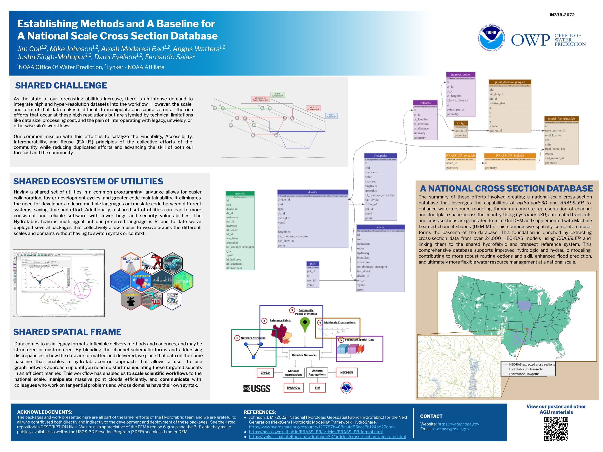
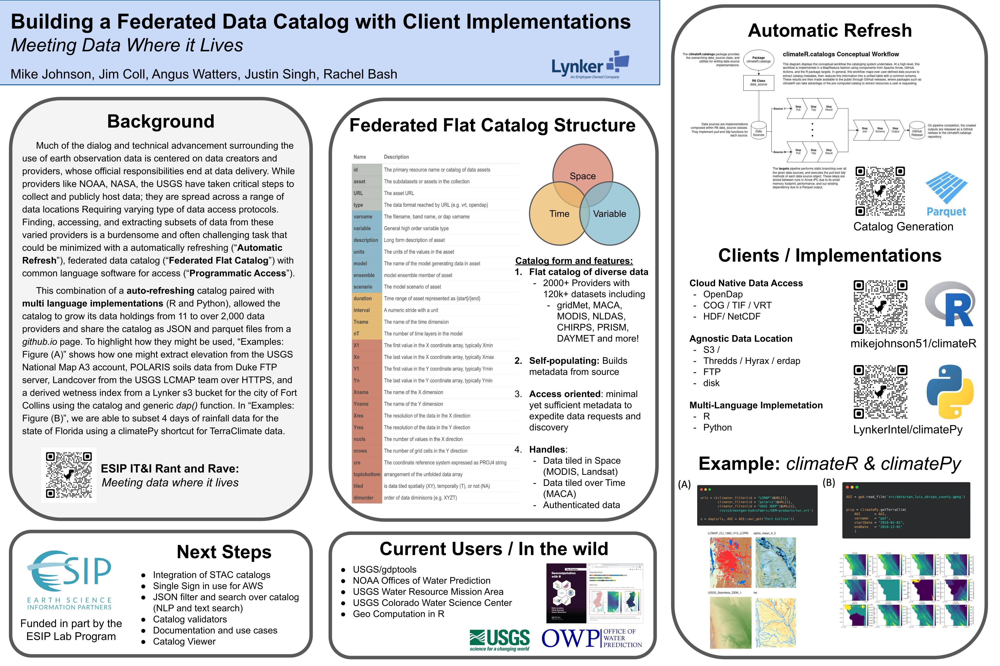
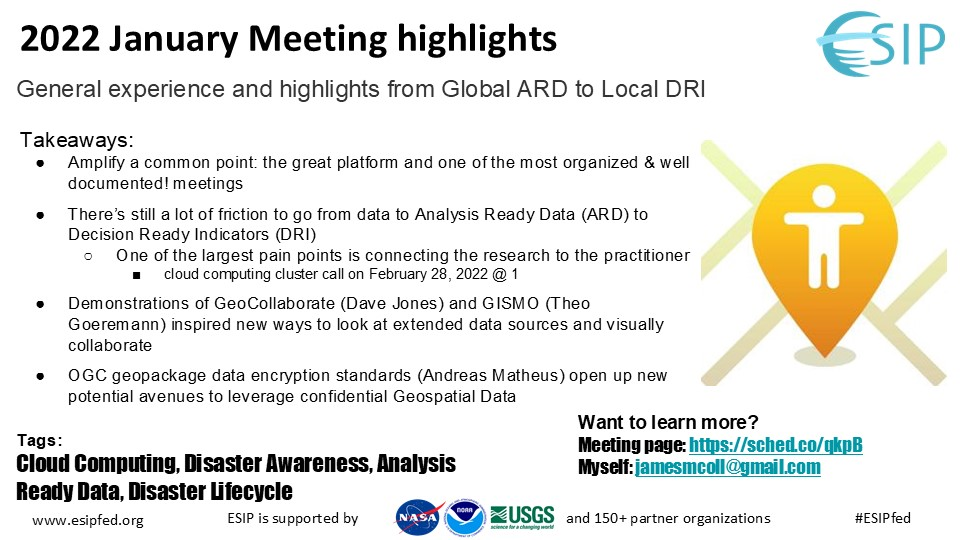

::: {.content-hidden}
# Now
[[20220227120733]] 01 Welcome to my Zenkettle  
[[20240113032207]] My public footprint

Related: [[20240325082848]] _creating knowledge

In page links:
[[atlas_index.qmd]] atlas_index.qmd
[[20240819044651]] I dislike blogs

[[FlatGrillDeck.qmd]]

:::
## Right now and at the top of my mind…
> From here onward, you're pretty deep into the weeds of my personal notes.  Expect to find a lot more unintelligible, poorly formatted, or otherwise broken thoughts and links.  Following in the footsteps of many of my [references and inspirations](atlas_index.qmd),[ > [[20240823024312.md]]]{.content-hidden} I'm exposing the nodes of my nonlinear manifesto and uncatagorized output here in the hopes that it makes my life easier, and presents a slightly more stimulating digital footprint for you to explore :)

1)  [[20220630144912]] 02 Now and [[20220227202414]] 03 What I'm is pondering these days.
2)  I'm still trying to put it all together and learn [[how to surf]], tackling my [wicked_problems.qmd](wicked_problems.qmd) with water.
3)  This system^[ [[20240429055542]] Zettlekasten] is a rebellion against my unruly digital footprint^[ [[20230829120127]] My digital footprint]
4)  If I had to state a "meaningful" work mission, I want to gamify water forecasting.  To accomplish that, I need to be smarter and have better systems.
       * My ideal game allows players to seamlessly scale from bed (mattress) to bed (Bald Eagle Domain)
       * Is a visually striking (representations of real world processes, exportable outputs) game (frictionless interactions)
5)  Explainable hydrology and how to better communicate and execute.
6)  How the constitution and founding values cross the digital divide.

## The Grill

::: {.callout-tip title="Presentation navigation tips" collapse="true"}
My preferred (FOSS) flavor of slidedecks, [revealjs](https://revealjs.com/), has intuitive but none the less unconventional PowerPoint presentation controls:

* Slides dynamically resize to use the entirety of the browser window, but you can still fullscreen with <kbd>F</kbd>
* I try and call out my [slide layout mode](https://revealjs.com/vertical-slides/#navigation-mode) in each presentation but I use vertical slides too often, press <kbd>space</kbd> or the <kbd>down arrow</kbd> key, not the <kbd>right arrow</kbd>, for most viewing situations.
  * You can press <kbd>R</kbd> or add `/scroll-view/` to the end of the url to make revealjs presentations more amenable to doom-scrolling motions, and is usually denoted with the phone icon under a presentation.
  * Press <kbd>N</kbd> or <kbd>space</kbd> for the next slide, <kbd>P</kbd> goes to the previous slide
* Press <kbd>M</kbd> to open to the menu
* Press <kbd>O</kbd> for the slide deck overview
* You can use the [chalkboard](https://quarto.org/docs/presentations/revealjs/presenting.html#chalkboard) to freemouse/touchpad draw
* Press <kbd>B</kbd> to black out the presentation screen
* Press <kbd>S</kbd> for a speaker view
* Press <kbd>Alt/Opt</kbd> + <kbd>+</kbd> to increase text size
* Press <kbd>Alt/Opt</kbd> + <kbd>-</kbd> to decrease text size
* Press <kbd>Alt/Opt</kbd> + <kbd>0</kbd> to reset the text size
* Press <kbd>Alt/Opt</kbd> + click on the slide to zoom in
* Press <kbd>C</kbd> to declare victory and head home^[A favored quote from one of my giants: [Dr. David Maidment](https://experts.utexas.edu/david_maidment)]
* Printing is never recommended, particularly if there are interactive elements in a deck; but if you really need to, follow these [instructions](https://revealjs.com/pdf-export/):
  * Add `?print-mode` to the url > Slides will load and look strange, that's fine.  
  * Print(<kbd>CTRL</kbd> + <kbd>P</kbd>) and make sure you select the `save to pdf` option, not `print with Microsoft Word`
  * Set margin to none
  * [X] Check the background image box
  * Print!

::: {.callout-note}
## Icon helpers
 I use for slides,  is scroll view  
 For videos,   For publications  
 For maps,  For interactive maps  
 For data downloads,  or  For attachments  
:::

::: {.content-hidden}

[[20250107085720]] Presenting tips
[[20240520093151]] Patterning presentation formats

[[20241119183423]] Quarto-revealjs helpers
[[20240517125035]] Presentation lists

Template: [Mine](reveal_3slide_deck_template.qmd) & [OWP](OWP_revealjs_template.qmd) | [revealjs_test_slidedeck](revealjs_test_slidedeck.qmd)

Placeholders:  
* [OWP_hydrofabric_flowline_fim.qmd](OWP_hydrofabric_flowline_fim.qmd)
* [FIM4](FIM4_workflow_slides.qmd)
* [History](FIM_history.qmd)
* [Grilledeck for portable?](GrillDeck.qmd)

:::

:::

```{r, fig.asp=0.77, out.width="95%", fig.width=6, fig.align="center", echo=FALSE, warning=FALSE}
library(magrittr)

get_random_string <- function(force_index=NULL) {
  # Move this chunck out if you need more?
  rnd_lst <- c("https://images.genius.com/854a6acd660a182792b4bebd26fb7d16.1000x1000x1.jpg",
               "https://static.wikia.nocookie.net/spongebob/images/b/b5/The_Krusty_Krab_Grill.png",
               "https://static.wikia.nocookie.net/spongebob/images/f/fa/SpongeBob_You%27re_Fired_title_card.png",
               "https://static1.srcdn.com/wordpress/wp-content/uploads/2020/06/Gordon-Ramsay-Its-Raw.jpg",
               "https://i.gifer.com/2cO5.gif",
               "https://64.media.tumblr.com/a6cc862604335d3b7487d212c2d5dd5f/tumblr_ogay5xUrNI1vqc713o1_400.gif")
  
  df <- data.frame(
    string = rnd_lst,
    random_number = runif(length(rnd_lst))
  )
  # --
  if(is.null(force_index)) { 
     random_index <- sample(1:nrow(df), 1)
  } else {
    random_index <- force_index
  }
  random_string <- df$string[random_index]
  return(random_string)
}

# https://forum.posit.co/t/how-to-add-a-hyperlink-to-an-image-created-by-knitr-include-graphics/99195
image_link <- function(image,url,...){
  htmltools::a(
    href=url,
    htmltools::img(src=image,...)
    )
}

# knitr::include_graphics(get_random_string())
image_link(get_random_string(),"FlatGrillDeck.html", width="95%")
```

[](FlatGrillDeck.qmd)  |   [](FlatGrillDeck.qmd/scroll-view)

This presentation deck is my revolving door of hot-off-the-grill results that I use for informal updates or impromptu meetings.   Don't expect what you find here to remain for very long, or to not change for 2 years because I do nothing...

## A chronological heap 

The idea of keeping a "Blog" makes me shudder for some reason.[ [[20240819044651]] I dislike blogs]{.content-hidden}  However, it's nice to keep a public and living record of what I'm up to and thinking about and this is as handy a place to start as any.  When I can't accrete my thoughts into a more meaningful form, or if I'm making a one-off presentation, a guest writeup, or self-trumpeted cross-post I'll throw it on the top of the heap here:

### My dissertation slides

Lets see how quickly this becomes irrelevant…

{fig-align="center" width=80%}

::: {.content-hidden}
[](templateannn_1.png)  |  [](JColl_Defense_Presentation.qmd)  |     |  
:::

### AGU 2024
[ [[20240717165343]] AGU 2024]{.content-hidden}
{fig-align="center" width=90%}

Cross-sectional representations of rivers are a critical form of data needed to understand and predict the behavior of the system, particularly for hydraulic and geomorphic applications.  However, the collection and curation of these data are non-trivial; and the way they are stored, found, and interacted with are not well described, particularly at continental scale.  This work describes the data sources, tools, and techniques used in developing a national scale cross section database.  By constructing a foundation of geometric transects augmented with machine learned synthetic bathymetric geometries and a pathway to blend data from HEC-RAS 1D models and parameterizations off eHydro and terrain where feasible, we present an iteration of a 3D channel geometry database.  The resulting data provides a standardized and scaled pattern and architecture which applications, which range from hydraulic routing and flood inundation mapping to river morphologic and environmental health and habitat indicators can be seeded.  That representation is easily discovered and extracted for a given domain following well established hydrofabric access patterns, and provides a consistent and scaled baseline for the Next Generation Water Resource Modeling Framework and associated applications.

### RIMORPHIS Workshop 2024

A presentation on [CONUS scale bathy toolings](https://docs.google.com/presentation/d/1zYWd40DcUSKqNkqzVM7ec4w3amJAiRMm/edit?usp=drive_link&ouid=115631749097086050321&rtpof=true&sd=true).

### CIROH DevCon 2024

At the CIROH Developers Conference, Mike Johnson and the hydrofabric team gave a followup presentation on the advances made over the last year on the Hydrofabric data and processing tools, including an explicit refactoring and aggregation over the reference fabric and the tie into learned cross section data for channel routing as preparation for NextGen simulation runs.  Find that tutorial [here](https://noaa-owp.github.io/hydrofabric/articles/devcon2024-tutorial.html).

### AGU 2023
::: {.content-hidden}
[[20230802170337]] AGU 2023

:::
{fig-align="center" width=90%}

The evolution of computational sciences leads to new data and more efficient formats and processing architectures to store, distribute, consume, and archive the data that are critical to model execution. These advances often lead to new use cases for those data, which have a rich legacy and can be costly to collect, collate, and archive; but the form of that initial deployment sometimes makes integrating those original data into newer use case workflows difficult. Those conflicting values create a need to make those model data more interoperable and reusable, and a need to increase their findability and accessibility, a manifestation of the FAIR data principles. This presentation will demonstrate how legacy HEC-RAS one-dimensional model datasets are transformed and made more FAIR for uses in work streams across the NOAA flood inundation mapping efforts and in the development of a nationwide 3D hydrofabric dataset that provides channel geometry between deep channel and its floodplain. After attending, participants should leave with a deeper understanding of the challenges, solutions, and tools available to manipulate and integrate these data into frameworks that extend far beyond their initial spatial scale; with a heavy emphasis on the details needed to integrate cross section representations and their reuse in HEC-RAS adjacent applications.  This also provides the opportunity to contribute and grow FAIR data transformation toolings and the communities that facilitate a bottom-up approach to scaling local hydraulic data to continental-scale efforts.

### Building for a moving target (ESIP 2023)

{fig-align="center" width=90%}

Last week at ESIP's 25th Annual Summer meeting in Burlington, VT , Lynker’s Mike Johnson, Jim Coll, Angus Watters, Justin Singh, and Rachel Bash presented on results from efforts funded through an ESIP Lab grant to improve the pathways and toolings around open data access representing their abstract “Building a Federated Data Catalog with Client Implementations, Meeting Data Where it Lives”.  By demonstrating an operational implementation of an automatically updating access point with multi-language support, we lower the barriers to scientific inquiry and open the doors to and between the larger open science community.  ESIP (Earth Science Information Partners) Meetings are collaborative, community-driven events that bring together federal partners and the most innovative thinkers & leaders around earth science data.  Learn more about the Federated catalog at [https://doi.org/10.6084/m9.figshare.23710017.v1](https://doi.org/10.6084/m9.figshare.23710017.v1), ESIP at their website he: https://www.esipfed.org/, and Lynker here: https://lynker.com/
[@johnsonBuildingFederatedData2023]

### ESIP January Meeting

{fig-align="center" width=90%}

### AGU 2022

FrankenFIM?

### Drone Mapping? (KU Geology Department and Field Station)

A link to an older presentation I gave as part of the centenial field camp 

### KU Field Station Science on Tap (Drones)

You can find a copy of that powerpoint here (as soon as I find it).

### AGU - 2019


### Kansas Governers Converence on the Future of Water in Kansas - November 2021

https://youtu.be/uapIeizWz2s?si=Dbj_kYleNiv22-DY&t=1005

### GSA 2014


